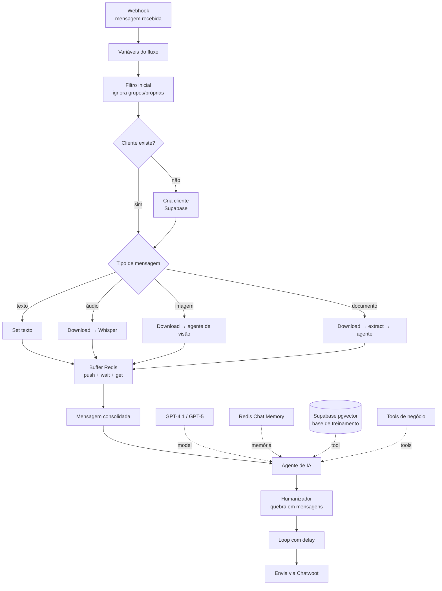

# Agentes de IA

Três agentes de WhatsApp que compartilham a mesma arquitetura de recepção e se
diferenciam pelas *tools* e pelo objetivo de negócio.

## Arquitetura comum

## Decisões de projeto

**Buffer de mensagens em Redis.** No WhatsApp o usuário manda "oi" / "queria saber"
/ "do produto X" em três mensagens. Sem buffer, o agente responde três vezes e
perde o contexto. As mensagens são empilhadas em Redis, um nó `Wait` segura o
fluxo, e só então o conteúdo consolidado vai ao agente — as execuções concorrentes
morrem ao ver que não são a última.

**Multimodal na entrada, não no agente.** Áudio, imagem e PDF são convertidos para
texto *antes* do agente (Whisper e agentes de visão dedicados). O agente principal
recebe sempre texto, o que mantém o prompt estável e o custo previsível.

**Humanizador na saída.** Um `chainLlm` separado quebra a resposta em mensagens
curtas, enviadas com delay — evita o "paredão de texto" que denuncia o bot.

**Output parser estruturado com auto-fixing.** As respostas do agente seguem um
schema; quando o modelo desvia, o parser de correção reprocessa em vez de quebrar
a execução.

## Os três agentes

| | [Vendedor](agente-vendedor/) | [SDR](agente-sdr/) | [Atendimento](agente-atendimento-suporte/) |
|---|---|---|---|
| Nós | 92 | 80 | 66 |
| Objetivo | Conduzir a venda | Qualificar e agendar | Suportar e escalar |
| CRM | Airtable (8 tools) | Airtable (6 tools) | Supabase |
| Extras | Follow-up autônomo | MCP + Google Calendar | Escalonamento humano |

---

## Créditos e escopo do trabalho próprio

A **arquitetura de recepção** compartilhada pelos três agentes — buffer de
mensagens em Redis, tratamento multimodal na entrada, humanizador na saída e
integração com Chatwoot — parte de um template de curso de automação com n8n, e
não é criação original minha.

O que foi construído por mim sobre essa base:

| Agente | Customizações próprias |
|---|---|
| [Vendedor](agente-vendedor/) | Modelagem do funil como 8 tools do Airtable; workflow de follow-up autônomo com recuperação de contexto via Memory Manager; seleção de modelo por tarefa |
| [SDR](agente-sdr/) | Camada **MCP** (servidor de agenda + cliente) desacoplando o Google Calendar dos agentes; funil de qualificação e critérios de agendamento |
| [Atendimento](agente-atendimento-suporte/) | Base de conhecimento em RAG; coleta de NPS; regras de escalonamento para humano |

Também são de minha autoria os prompts, a modelagem de dados no Supabase e no
Airtable, e a adaptação de cada agente ao contexto do cliente.

Os demais diretórios deste repositório ([`rag/`](../rag/),
[`pipelines/`](../pipelines/), [`integrations/`](../integrations/),
[`utils/`](../utils/)) são construções originais.
