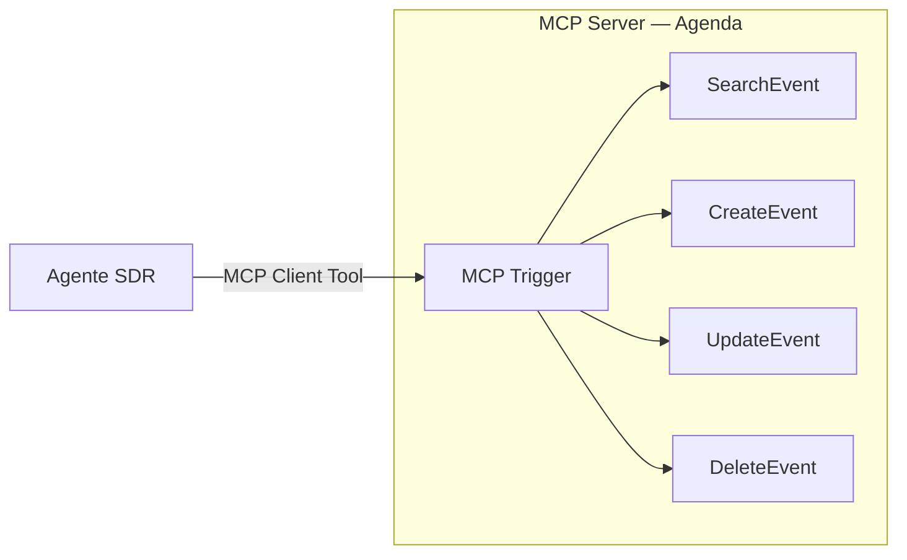

# Agente SDR

Agente de pré-vendas que qualifica leads no WhatsApp e agenda reuniões
diretamente no Google Calendar — com o calendário exposto via **MCP**.

**80 nós** · MCP Server + MCP Client · Google Calendar · RAG · Airtable

## Diferencial: MCP (Model Context Protocol)

Em vez de plugar os nós do Google Calendar direto no agente, este workflow
publica um **MCP Server** dedicado ao calendário e o consome como cliente:

**Por que isso importa:** as quatro operações de agenda viram um serviço com
contrato próprio, reutilizável por qualquer outro agente — ou por qualquer
cliente MCP fora do n8n. Trocar a agenda de Google para Outlook mexe só no
servidor; nenhum agente consumidor é alterado.

É a diferença entre acoplar tools a um agente e construir uma **camada de
capacidades compartilhada**.

## Funil de qualificação

| Tool | Estágio |
|---|---|
| `crm_novolead` | Lead capturado |
| `crm_conexao` | Contato estabelecido |
| `crm_qualificado` | Passou nos critérios de qualificação |
| `crm_agendado` | Reunião marcada na agenda |
| `crm_desqualificado` | Sem fit |
| `crm_update` | Atualização de dados do lead |

O agente também dispõe de `update_cadastro` (Supabase) e `redirect_human`, que
escala a conversa para um humano quando detecta que não deve seguir sozinho.

## Fluxo

Compartilha a arquitetura de recepção descrita no [README dos agentes](../README.md):
webhook → filtro → identificação do cliente → tratamento multimodal → buffer Redis
→ agente → humanizador → envio.

O que muda é o objetivo: aqui o agente não vende, **qualifica e agenda**. A
conversa termina em um evento no calendário ou em uma desqualificação registrada.

## Dependências

- Redis, Supabase (`pgvector`), Airtable, Chatwoot, OpenAI
- Google Calendar (OAuth2)
- n8n com nós MCP habilitados
