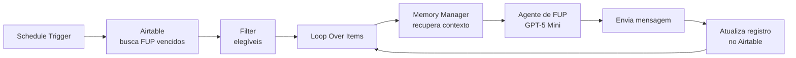

# Agente Vendedor

Agente de vendas para WhatsApp que conduz o lead pelo funil, atualiza o CRM a cada
mudança de estágio e executa follow-ups de forma autônoma.

**92 nós** · 4 agentes de IA · 8 tools de CRM · RAG · Redis · Airtable · Supabase

> **Nota de créditos:** a arquitetura de recepção (buffer Redis, entrada
> multimodal, humanizador, Chatwoot) parte de um template de curso de
> automação com n8n. As customizações próprias estão detalhadas em
> [Créditos e escopo do trabalho próprio](../README.md#créditos-e-escopo-do-trabalho-próprio).

## Problema

Leads chegam pelo WhatsApp em volume, em horários irregulares e em formatos
variados (texto, áudio, foto de produto, PDF de proposta). Um vendedor humano
perde leads por tempo de resposta e esquece de fazer follow-up — que é onde está
a maior parte da conversão.

## Solução

O agente responde em segundos, qualifica pela base de conhecimento, movimenta o
lead no CRM e agenda o próprio follow-up.

### Funil como tools

Cada estágio do funil é uma tool do Airtable que o agente chama por decisão
própria, conforme a conversa evolui:

| Tool | Quando o agente aciona |
|---|---|
| `crm_novolead` | Primeiro contato registrado |
| `crm_conexao` | Lead respondeu e houve engajamento |
| `crm_qualificacao` | Perfil e necessidade identificados |
| `crm_proposta` | Proposta comercial apresentada |
| `crm_ganho` | Venda fechada |
| `crm_perdido` | Lead descartado ou sem fit |
| `crm_followup` | Retorno agendado para data futura |
| `crm_leadinfo` | Consulta de dados já registrados |

Modelar o funil como tools — em vez de um `switch` com regras fixas — deixa a
transição de estágio a cargo do LLM, que enxerga nuance que regra não pega.

### Follow-up autônomo

Um schedule varre os follow-ups vencidos, recupera o **contexto da conversa
anterior** via Memory Manager e gera uma mensagem contextualizada — não um
template. O agente sabe o que já foi conversado.

## Modelos

| Uso | Modelo | Motivo |
|---|---|---|
| Agente principal | GPT-4.1 | Qualidade de raciocínio nas tools |
| Análise de imagem/documento | GPT-4.1 | Capacidade multimodal |
| Roteamento de tools do CRM | GPT-5 | Precisão na escolha de estágio |
| Follow-up | GPT-5 Mini | Tarefa simples, custo por execução importa |

## Dependências

- Redis (buffer de mensagens e memória de conversa)
- Supabase (cadastro de clientes + `pgvector` para RAG)
- Airtable (CRM)
- Chatwoot (envio e recebimento de mensagens)
- OpenAI

## Importar

Importe `workflow.json` no n8n, recrie as credenciais e defina as variáveis de
ambiente. Detalhes no [README raiz](../../README.md#como-usar).
