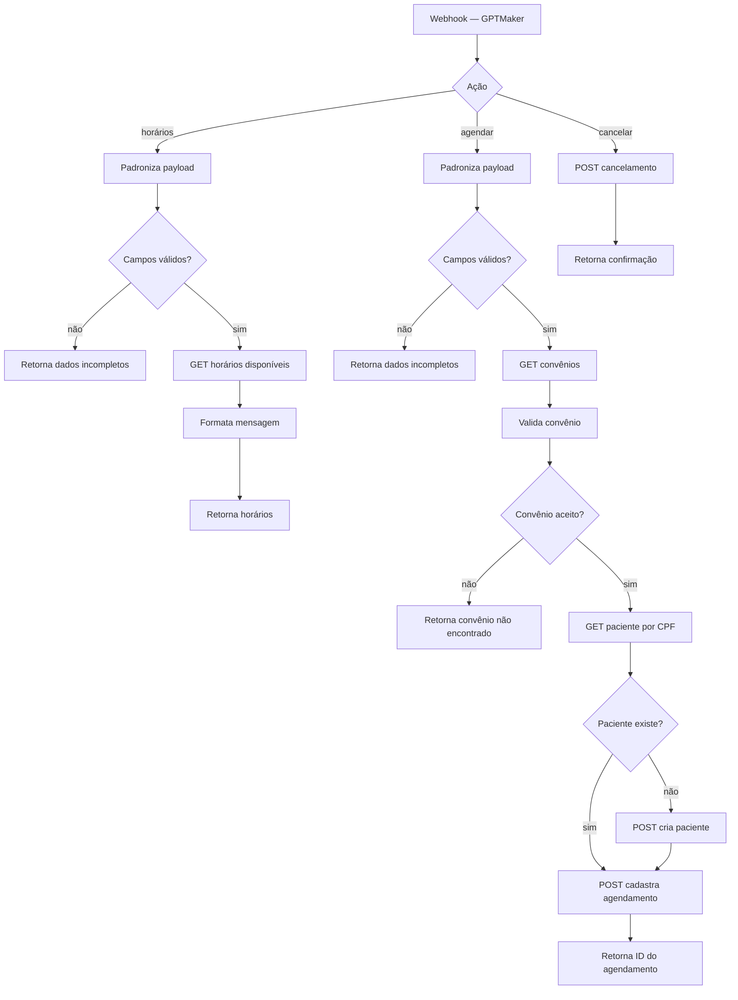

# VITALE — Integração 4Medic

Camada de integração que expõe a API de agendamento médico **4Medic** como um
endpoint único, consumido por um agente de IA na plataforma GPTMaker.

**22 nós** · webhook roteado por ação · 6 respostas síncronas

## O padrão: um webhook, três ações

Em vez de três endpoints, o workflow recebe tudo em um webhook e roteia por um
campo de ação — o agente de IA precisa conhecer apenas uma URL.

## Decisões de projeto

**Validação antes da chamada externa.** Cada ramo checa os campos obrigatórios
antes de tocar a API. LLM alucina parâmetro; validar na borda transforma isso em
uma mensagem de erro clara em vez de um 400 opaco vindo do fornecedor.

**Get-or-create de paciente.** O fluxo consulta o CPF e cria o cadastro apenas se
não existir. O agente não precisa saber se é paciente novo — pede o agendamento e
a integração resolve.

**Convênio validado contra a lista real.** Antes de agendar, o convênio informado
é conferido contra os aceitos pela clínica, com resposta específica quando não
consta. Evita agendamento que seria recusado na recepção.

**Seis respostas distintas.** Cada caminho — sucesso, dados incompletos (dois
contextos), convênio inválido, cancelamento, ID do agendamento — tem seu próprio
`Respond to Webhook`. O agente recebe respostas semanticamente diferentes e sabe
o que dizer ao paciente em cada situação.

## Dependências

API 4Medic (Bearer token) · GPTMaker

> O token foi substituído por `{{ $env.API_TOKEN }}`.
