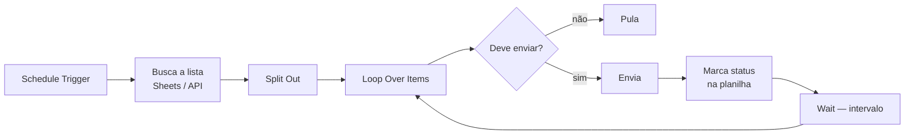

# Pipelines operacionais

Automações de processamento em lote: réguas de cobrança, cadências de follow-up,
campanhas de mensagem e sincronização de dados.

| Workflow | O que faz |
|---|---|
| [Disparo de Boleto](executive-disparo-boleto/) | Régua de cobrança em múltiplas janelas (D+2 a D+15) |
| [Cadência de Follow-up](cadencia-follow-up/) | Orquestrador + 3 sub-workflows de follow-up |
| [Disparo Ativo WhatsApp](disparo-ativo-whatsapp/) | Campanhas com limite diário e controle de status |
| [Sync Sheets → Supabase](artpel-sync-supabase/) | Upsert em lote a cada hora |

## Padrão comum

Todos seguem a mesma espinha dorsal, que é o que torna disparo em massa viável
sem tomar bloqueio:

**Marcar status antes do próximo item** é o que garante idempotência: se a
execução cair na metade, o reprocessamento não envia duas vezes para quem já
recebeu. **O `Wait` dentro do loop** espaça os envios — disparo sem intervalo é o
caminho mais rápido para um número bloqueado.
