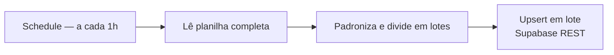

# ArtPel — Sync Google Sheets → Supabase

Sincronização horária de uma planilha para o Supabase, via upsert em lote.

**4 nós** · Google Sheets · Supabase REST · Schedule

## O nó que faz o trabalho

Toda a lógica está no nó de código: normaliza os campos vindos da planilha
(tipos, espaços, valores vazios) e **agrupa os registros em lotes** antes de
enviar. Uma requisição por linha em uma planilha de milhares de itens estoura
tempo de execução e rate limit; em lote, a sincronização inteira cabe em poucas
chamadas.

O `upsert` (em vez de insert) torna a operação **idempotente**: rodar duas vezes
seguidas produz o mesmo resultado, então uma execução repetida ou sobreposta não
duplica dados.

Pequeno em número de nós, mas é o padrão que sustenta o RAG de
[consulta de estoque](../../rag/artpel-consulta-estoque/).

## Dependências

Google Sheets (OAuth2) · Supabase (`{{ $env.SUPABASE_SERVICE_KEY }}`)

> ⚠️ Este workflow usa a **service key** do Supabase, que ignora RLS. Mantenha-a
> exclusivamente em variável de ambiente.
