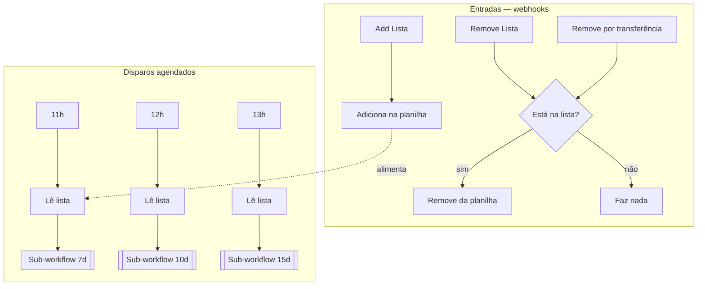
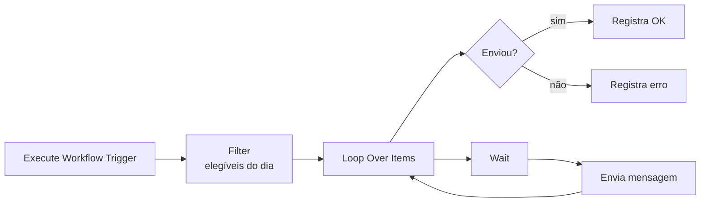

# Cadência de Follow-up

Régua de follow-up em três tempos (7, 10 e 15 dias), construída como um
**orquestrador + três sub-workflows** em vez de um fluxo monolítico.

**4 workflows** · Google Sheets · sub-workflows · webhooks de entrada e saída

| Arquivo | Papel |
|---|---|
| [`00-orquestrador.json`](00-orquestrador.json) | Gerencia a lista e aciona as etapas |
| [`01-fup-7d.json`](01-fup-7d.json) | Follow-up de 7 dias |
| [`02-fup-10d.json`](02-fup-10d.json) | Follow-up de 10 dias |
| [`03-fup-15d.json`](03-fup-15d.json) | Follow-up de 15 dias |

## Arquitetura

Cada sub-workflow tem a mesma forma interna:

## Por que sub-workflows

As três etapas diferem apenas no filtro de dias e no texto da mensagem. Como
workflows separados chamados via `Execute Workflow`:

- **Cada etapa é testável isoladamente** — dá para rodar só o de 15d sem disparar os outros;
- **Uma falha em uma etapa não derruba as demais**;
- **Adicionar um follow-up de 30 dias** é criar um workflow e uma linha no orquestrador, sem tocar no que já funciona;
- **O orquestrador fica legível** — ele coordena, não executa.

Esse é o mesmo raciocínio de extrair funções em código: a duplicação de estrutura
é intencional e o ganho está no isolamento.

## Saída e remoção da lista

Três webhooks controlam a saída da cadência — inclusive um específico para
**transferência de atendimento**. Quando o lead é transferido para um humano, ele
sai da régua automaticamente, evitando o pior cenário de uma cadência: o cliente
já estar falando com alguém e continuar recebendo mensagem automática.

## Dependências

Google Sheets (OAuth2) · API de mensagens com Bearer token
