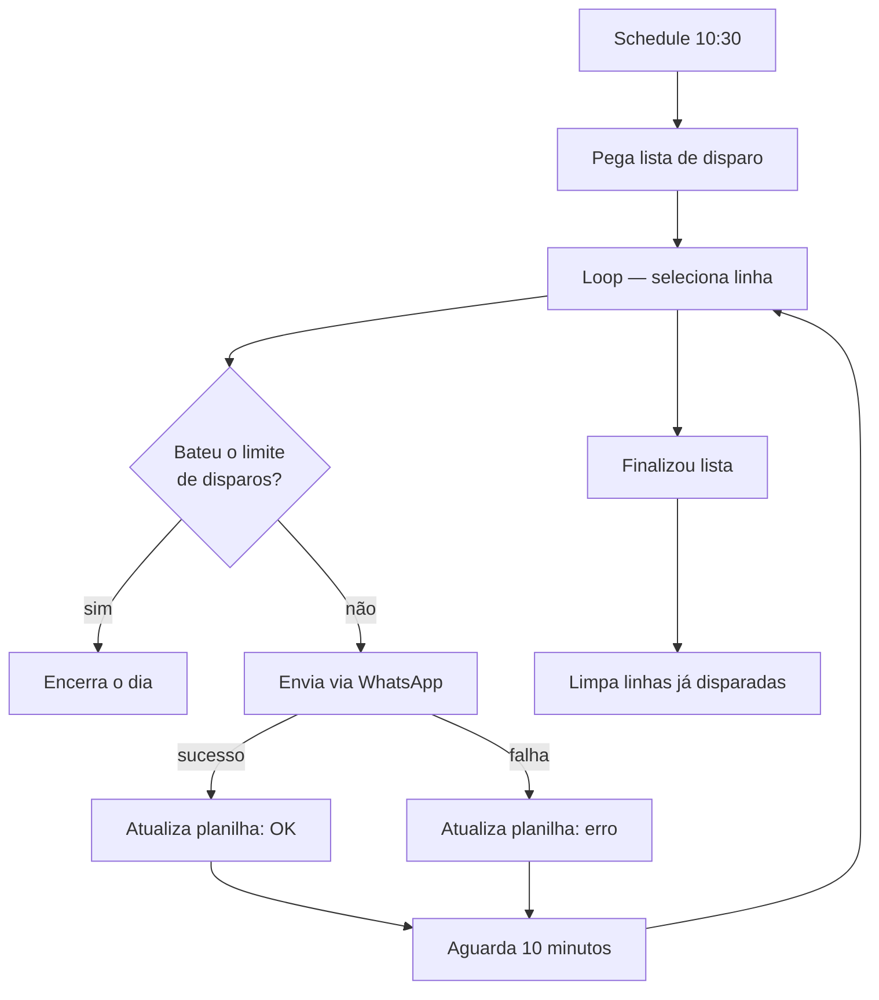

# Disparo Ativo — WhatsApp Cloud API

Campanhas de mensagem ativa a partir de uma planilha, com limite diário e
controle de status por linha.

**2 workflows** · WhatsApp Cloud API · Google Sheets

| Arquivo | Modo |
|---|---|
| [`disparo-agendado.json`](disparo-agendado.json) | Agendado, 100% automático |
| [`saude-prevent.json`](saude-prevent.json) | Manual, para campanhas pontuais |

## Fluxo agendado

## Decisões

**Limite diário de disparos.** O fluxo para sozinho ao atingir a cota — número
novo que dispara centenas de mensagens no primeiro dia é banido. O limite protege
a reputação do número.

**10 minutos entre mensagens.** Cadência deliberadamente lenta, mais próxima de
comportamento humano que de robô.

**Status por linha, com sucesso e erro separados.** Falhas ficam registradas em
coluna própria e podem ser reprocessadas sem reenviar para quem já recebeu.

**Limpeza ao final.** Linhas já disparadas são removidas, mantendo a planilha como
fila de trabalho em vez de log infinito.

## Dependências

WhatsApp Cloud API (Meta) · Google Sheets (OAuth2)
