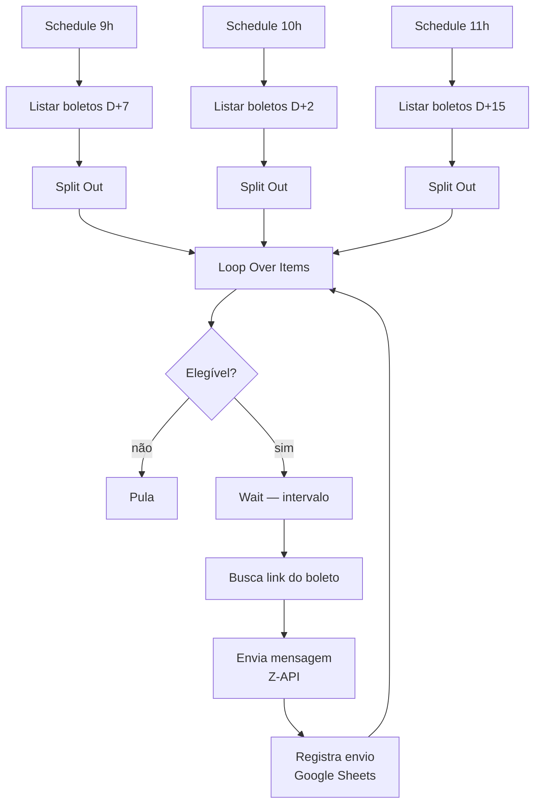

# Executive — Régua de Cobrança via WhatsApp

Automação de cobrança que consulta boletos por janela de vencimento e dispara a
mensagem com o link de pagamento pelo WhatsApp.

**39 nós** · Z-API · Google Sheets · 3 schedules

## Régua

O workflow trata cinco janelas de vencimento — `D+2`, `D+3`, `D+4`, `D+7` e
`D+15` — cada uma com sua consulta à API e sua mensagem. Três schedules
independentes (**9h**, **10h** e **11h**) distribuem as ondas ao longo da manhã,
em vez de concentrar tudo em um pico.

## Pontos de engenharia

**Link buscado por item, não em lote.** O link do boleto é gerado sob demanda
imediatamente antes do envio — links pré-gerados expiram e o cliente recebe uma
URL morta.

**Registro duplo na planilha.** Cada envio grava em duas abas (controle
operacional e histórico), permitindo auditar a régua sem consultar a API.

**Rate limiting explícito.** Nós `Wait` entre envios mantêm a cadência dentro do
limite da Z-API.

**Trigger manual preservado.** Além dos schedules, o fluxo tem gatilho manual para
reprocessamento pontual sem esperar a próxima janela.

## Dependências

Z-API (WhatsApp) · Google Sheets (OAuth2) · API de boletos com Bearer token

> Os tokens foram substituídos por `{{ $env.ZAPI_TOKEN }}` e `{{ $env.API_TOKEN }}`.
