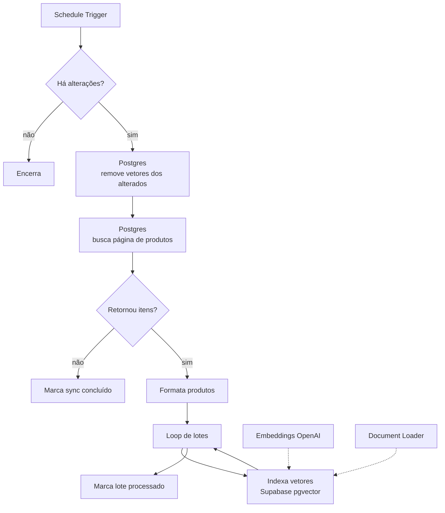
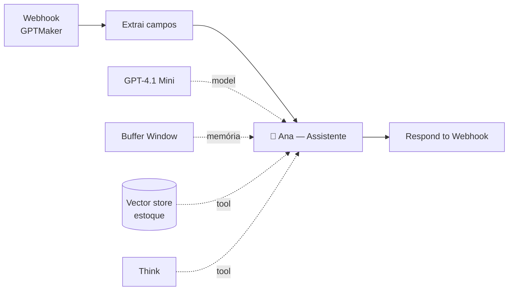

# ArtPel — Consulta de Estoque via IA

Assistente que responde perguntas sobre o estoque em linguagem natural, sobre uma
base vetorial mantida sincronizada com o ERP.

**25 nós** · Postgres · Supabase `pgvector` · OpenAI · webhook síncrono

## O problema do RAG sobre dados que mudam

Catálogo de estoque não é documento estático: preço muda, produto sai de linha,
entra item novo. Reindexar o catálogo inteiro a cada hora é caro e lento.

Este workflow separa **ingestão** de **consulta**, e a ingestão é incremental.

## Pipeline de ingestão (agendado)

Três decisões que fazem esse pipeline funcionar em produção:

1. **Delete-then-insert.** Vetores dos produtos alterados são removidos antes da
   reindexação — sem isso, a base acumula versões velhas e o agente responde com
   preço desatualizado.
2. **Paginação no Postgres.** Catálogos grandes não cabem em memória; o fluxo
   busca página a página e só encerra quando a consulta volta vazia.
3. **Loop de lotes com marcação de progresso.** Cada lote indexado é registrado
   no banco, então uma falha no meio não obriga a recomeçar do zero.

## Consulta (tempo real)

A resposta é **síncrona**: o webhook do GPTMaker fica aberto até o agente
concluir, via `Respond to Webhook`. O cliente da plataforma recebe a resposta na
mesma requisição, sem callback.

`GPT-4.1 Mini` é suficiente aqui — o trabalho difícil é da busca vetorial, o
modelo apenas redige a resposta sobre o contexto recuperado.

## Dependências

Postgres (ERP) · Supabase com `pgvector` · OpenAI · GPTMaker
