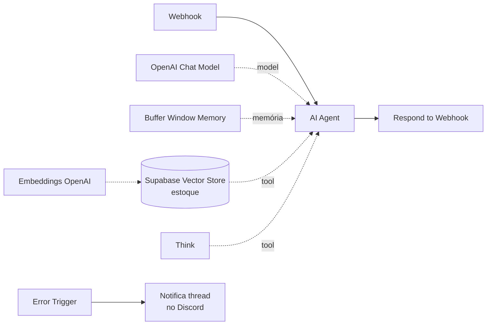

# Chat RAG

Implementação enxuta de RAG: webhook, agente com vector store e resposta síncrona.
Bom ponto de partida para entender o padrão antes de olhar os agentes maiores.

**10 nós** · Supabase `pgvector` · OpenAI

## Observabilidade

O detalhe que separa protótipo de produção aqui é o **Error Trigger**: qualquer
falha na execução dispara uma notificação em uma thread do Discord. Sem isso, um
agente que quebra silenciosamente só é descoberto pelo cliente reclamando.

## Dependências

Supabase com `pgvector` · OpenAI · webhook do Discord
